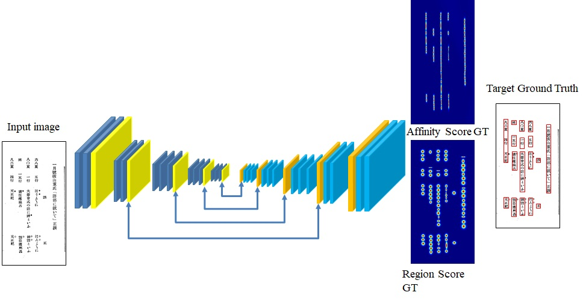
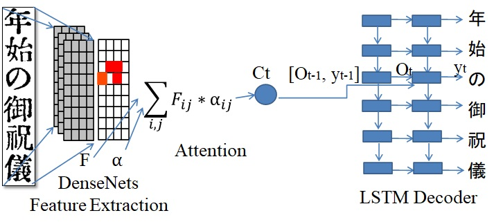
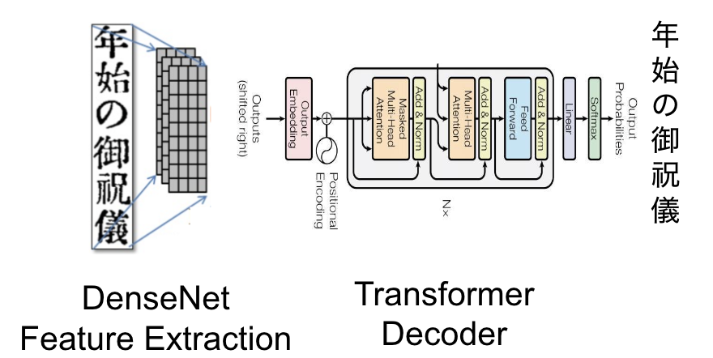

# Kindai-OCR
OCR system for recognizing modern Japanese magazines

# Updates:
Kindai V2.0 employed Transformer OCR for text recognition. Transformer OCR was trained on NDL and CODH datasets.

## About

This repo contains an OCR system for converting modern Japanese images to text. The software has been developed by Dr. Anh Duc Le, while he was working for <a href="http://codh.rois.ac.jp/">ROIS-DS Center for Open Data in the Humanities</a>.

The system has 2 main modules: text line extraction and text line recognition. The overall architecture is shown in the below figures.

### Text line extraction
We retrain the CRAFT (Character Region Awareness for Text Detection) on 1000 annotated images provided by Center for Research and Development of Higher Education, The University of Tokyo.



### Text line recognition
For Kindai V1.0, we employ the attention-based encoder-decoder on our previous publication. We train the text line recognition on 1000 annotated images and 1600 unannotated images provided by Center for Research and Development of Higher Education, The University of Tokyo and National Institute for Japanese Language and Linguistics, respectively.     
    


For Kindai V2.0, we trained a transformer with more data from National Diet Library (NDL) and The Center for Open Data in The Humanities (CODH).
[NDL dataset](https://github.com/ndl-lab/pdmocrdataset-part2) contains 3,997 pages, 103,256 lines and [CODH dataset](http://codh.rois.ac.jp/modern-magazine/dataset/) contains 1985 pages and 59,465 lines.     

     



## Installing Kindai OCR

```Python==3.7.11         
torch==1.7.0     
torchvision==0.8.1     
opencv-python==3.4.2.17     
scikit-image==0.14.2     
scipy==1.1.0     
Polygon3     
pillow==4.3.0     
pytorch-lightning==1.3.5     
einops==0.3.0     
editdistance==0.5.3
```  


## Running Kindai OCR
- You should first download the pre_trained models and put them into ./pretrain/ folder.
[VGG model](https://drive.google.com/file/d/1_A1dEFKxyiz4Eu1HOCDbjt1OPoEh90qr/view?usp=sharing), [CRAFT model](https://drive.google.com/file/d/1-9xt_jjs4btMrz5wzrU1-kyp2c6etFab/view?usp=sharing), [OCR V1.0 model](https://drive.google.com/file/d/1mibg7D2D5rvPhhenLeXNilSLMBloiexl/view?usp=sharing), [OCR V2.0 model](https://drive.google.com/file/d/1cq4PwPS2mXXRjOApst2i7n4G3mBSVqpI/view?usp=drive_link)
- Copy your images into ./data/test/ folder   
- run the following script to recognize images:   
`python test_kindai_1.0.py`   
`python test_kindai_2.0.py`   
- The recognized text transcription is in ./data/result.xml and the result images are in ./data/result/   
- If you may have to check the path to Japanese font in test.py for correct visualization results.   
    `fontPIL = '/usr/share/fonts/truetype/fonts-japanese-gothic.ttf' # japanese font`   
- using --cuda = True for GPU device and Fasle for CPU device    
- using --canvas_size ot set image size for text line detection   
 - An example result from our OCR system

 

 ## Citation
 If you find Kindai OCR useful in your research, please consider citing:   
 Anh Duc Le, Daichi Mochihashi, Katsuya Masuda, Hideki Mima, and Nam Tuan Ly. 2019. Recognition of Japanese historical text lines by an attention-based encoder-decoder and text line generation. In Proceedings of the 5th International Workshop on Historical Document Imaging and Processing (HIP ’19). Association for Computing Machinery, New York, NY, USA, 37–41. DOI:https://doi.org/10.1145/3352631.3352641   


 ## Acknowledgment

We thank The Center for Research and Development of Higher Education, The University of Tokyo, and National Institute for Japanese Language and Linguistics for providing the kindai datasets.     

## Contact
Dr. Anh Duc Le, email: leducanh841988@gmail.com or anh@ism.ac.jp    
